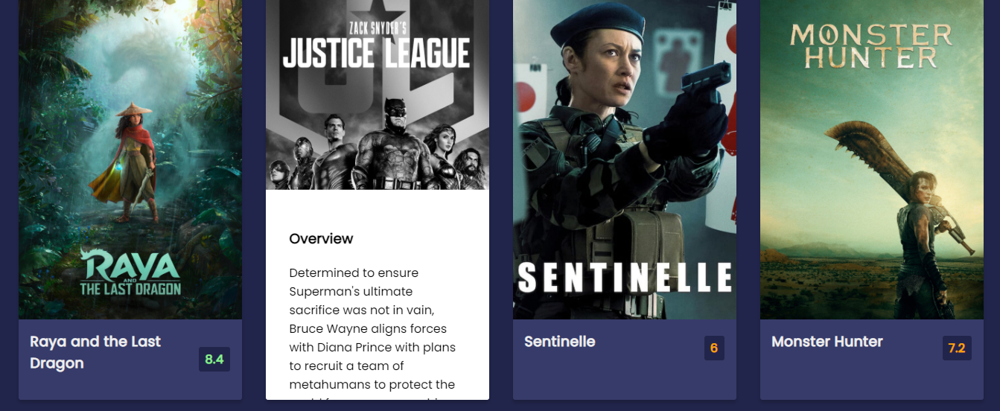
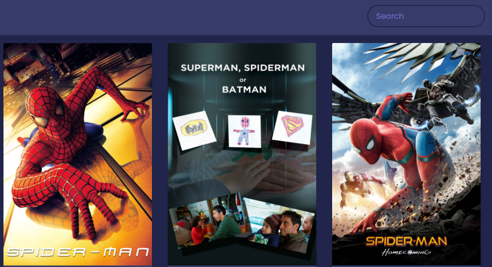

## Table of contents
* [General info](#general-info)
* [Technologies](#technologies)
* [Setup](#setup)

## Description
This project is the design of the MovieSurfer App. User can explore and discover the most popular, the highest rated and the most rated movies.
All in real time  in Surfer Web App

## Features
* Discover the most popular, the highest rated and the most rated movies

* Search for movies.
* IDMB Ratings.

* Offline work.
* Material design.
* UI optimized for phone and tablet.

* Localization.
 
* Detail page.
* [Technologies](#technologies)
* [Setup](#setup)
	
## Technologies
Project is created with:
* HTML5
* CSS
* Javascript: Standard ES6 

	
## Setup
To run this project, install live extention on your favorite text-Editor and run it.

 
